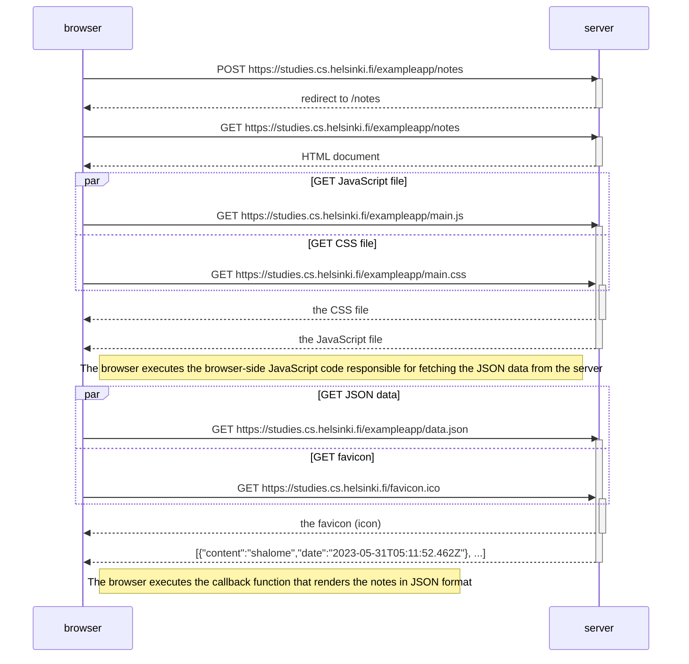

# Sequence diagram for adding a new note

```mermaid
sequenceDiagram
    participant browser
    participant server

    browser->>server: POST https://studies.cs.helsinki.fi/exampleapp/notes
    activate server
    server-->>browser: redirect to /notes
    deactivate server

    browser->>server: GET https://studies.cs.helsinki.fi/exampleapp/notes
    activate server
    server-->>browser: HTML document
    deactivate server

    par GET JavaScript file
        browser->>server: GET https://studies.cs.helsinki.fi/exampleapp/main.js
        activate server
    and GET CSS file
        browser->>server: GET https://studies.cs.helsinki.fi/exampleapp/main.css
        activate server    
    end

    server-->>browser: the CSS file
    deactivate server

    server-->>browser: the JavaScript file
    deactivate server

    Note right of browser: The browser executes the browser-side JavaScript code responsible for fetching the JSON data from the server

    par GET JSON data
        browser->>server: GET https://studies.cs.helsinki.fi/exampleapp/data.json
        activate server
    and GET favicon
        browser->>server: GET https://studies.cs.helsinki.fi/favicon.ico
        activate server
    end

    server-->>browser: the favicon (icon)
    deactivate server

    server-->>browser: [{"content":"shalome","date":"2023-05-31T05:11:52.462Z"}, ...]
    deactivate server

    Note right of browser: The browser executes the callback function that renders the notes in JSON format
```
