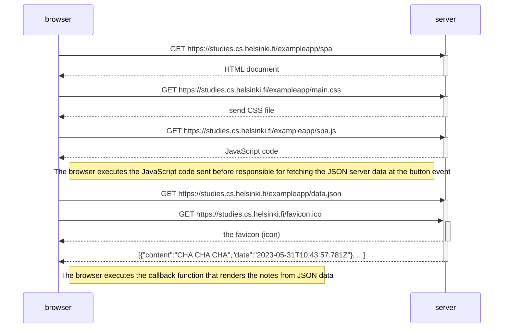

# Sequence diagram for visiting the Single Page App

```mermaid
sequenceDiagram
    participant browser
    participant server

    browser->>server: GET https://studies.cs.helsinki.fi/exampleapp/spa
    activate server
    server-->>browser: HTML document
    deactivate server

    browser->>server: GET https://studies.cs.helsinki.fi/exampleapp/main.css
    activate server
    server-->>browser: send CSS file
    deactivate server

    browser->>server: GET https://studies.cs.helsinki.fi/exampleapp/spa.js
    activate server
    server-->>browser: JavaScript code
    deactivate server

    Note right of browser: The browser executes the JavaScript code sent before responsible for fetching the JSON server data at the button event

    browser->>server: GET https://studies.cs.helsinki.fi/exampleapp/data.json
    activate server

    browser->>server: GET https://studies.cs.helsinki.fi/favicon.ico
    activate server
    server-->>browser: the favicon (icon)
    deactivate server

    server-->>browser: [{"content":"CHA CHA CHA","date":"2023-05-31T10:43:57.781Z"}, ...]
    deactivate server

    Note right of browser: The browser executes the callback function that renders the notes from JSON data
```
